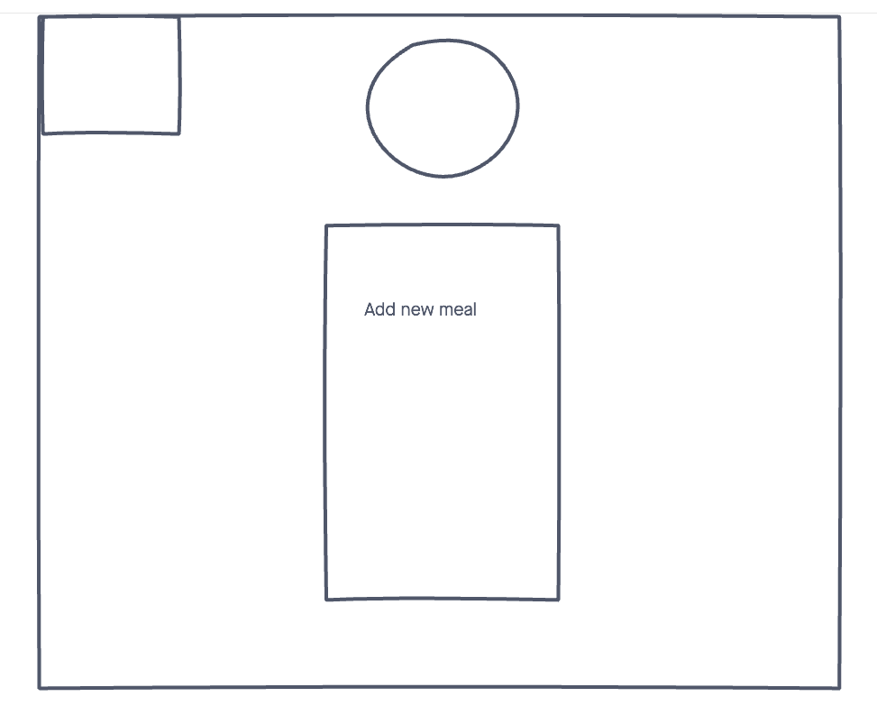

# food-truck-hunt
App intended to be a back office POS system. Right now the functions are for a user to be able to log in and punch in for their shift.

## ⚙️ Technologies Used
- HTML5
- CSS3
- Node.js
- Express
- MongoDB
- Heroku (for deployment)

## 📸 Screenshots

## 🎬 Getting Started
[Click](https://food-truck-hunt.herokuapp.com/users/signin) here to see the live app! 

## 🛠 Future Enhancements
- Add POS System with Swipe Add To Cart Feature
- Make Accessible to Any Independent Retailer 
- Embed Store Locator 